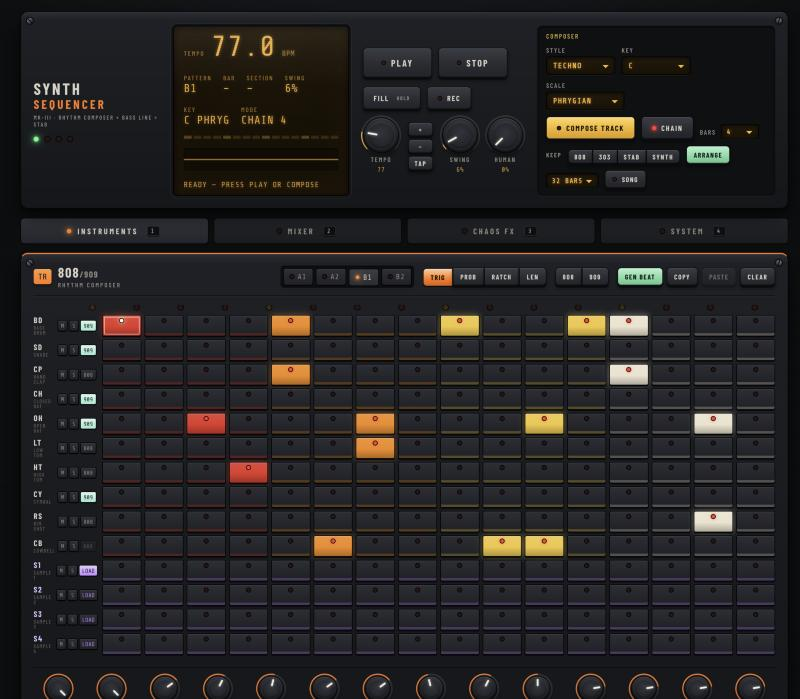
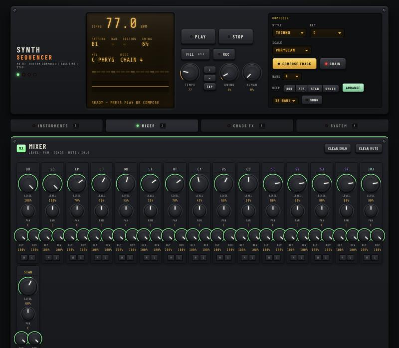
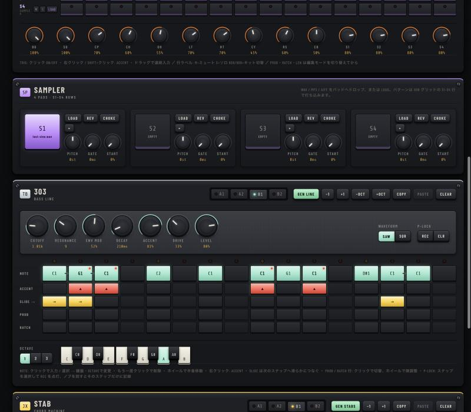
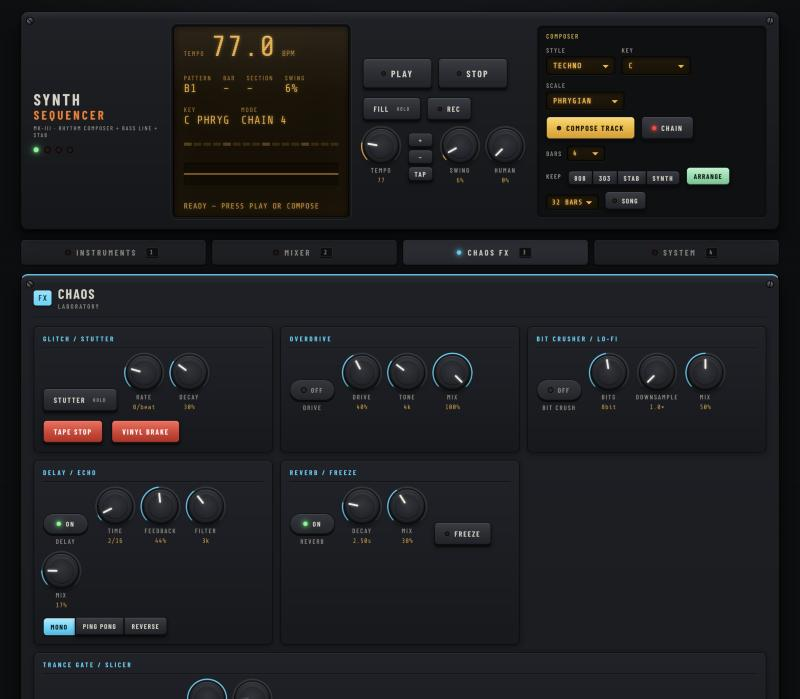

# SYNTH SEQUENCER MK-III — TR-808/909 + TB-303 + STAB Groovebox

ブラウザだけで動くグルーヴボックスです。ドラムマシン（808 / 909 の 2 キット）、ベースライン（303 系）、コードスタブ、サンプラー、ミキサー、エフェクト、曲構成の自動生成、MIDI、WAV / JSON 書き出しを 1 画面にまとめています。ビルド工程や外部ライブラリはなく、静的ファイルをそのまま配信するだけで動きます。



## 特徴

### 楽器
- **TR-808 / TR-909 ドラム（10 ボイス）**: BD / SD / CP / CH / OH / LT / HT / CY / RS / CB。ボイスごとに 808 と 909 の音色を切り替えられます（行ラベルの `808` / `909` ボタン、または一括切替）。すべて Web Audio で合成しています。
- **サンプラー（4 パッド）**: WAV / MP3 / AIFF などをドロップまたは LOAD で読み込み、808 グリッドの S1〜S4 行で打ち込みます。PITCH（±24 半音）・GATE・START・REV（逆再生）・CHOKE。音声はブラウザの IndexedDB に保存されます。
- **TB-303 ベース**: 常駐オシレーター構成でスライドは本物のレガート。CUTOFF / RESONANCE / ENV MOD / DECAY / ACCENT / DRIVE / LEVEL、SAW / SQR。
- **コードスタブ（JX 系）**: デチューンした 2 基のノコギリ波 × 和音構成音、フィルターエンベロープ、コーラス。コード種は m / M / m7 / M7 / 7 / sus2 / sus4 / m9 / dim / 5。

### シーケンサー
- 4 パターン（A1 / A2 / B1 / B2）、チェイン再生、パターンごとにドラム・ベース・スタブを保持。
- **ステップごとの確率とラチェット**: ドラムは編集モード（TRIG / PROB / RATCH / LEN）を切り替えて入力。303 には PROB / RATCH 行があります。
- **トラック別ステップ数（ポリメーター）**: LEN モードで最後のステップをクリック。303 は POLY 303 で別途設定。
- **パラメータロック**: 303 のステップを選択して P-LOCK の REC を点灯し、ノブを回すとそのステップだけに CUTOFF / RESONANCE / ENV MOD / DECAY を記録。
- **FILL**（押している間だけフィルイン）、**HUMAN**（発音タイミングと強さの揺らぎ）、**TAP** テンポ、SWING。
- **SONG モード**: ARRANGE を押すと現在の 4 パターンから 32 / 64 小節の曲構成（INTRO → BUILD → DROP → BREAK → …）を生成し、ミュート・マスターフィルター・ディレイを小節単位で自動操作します。

### 自動生成（COMPOSER）
- STYLE（TECHNO / HOUSE / ACID / ELECTRO / MINIMAL / BREAKS）、KEY、SCALE を選んで COMPOSE TRACK。ビート、ベースライン、スタブのコード進行、キット、音色、テンポ、スイングを一括で生成します。
- **KEEP**（808 / 303 / STAB / SYNTH）を点灯すると、その部分は作り直さずに残りだけ再生成します。
- 生成結果は必ずキーとスケール内に収まり、スライドは隣接ノート間だけ、アクセントとスライドには上限があります。

### ミキサー
- 全 16 チャンネル（ドラム 10 + サンプル 4 + 303 + STAB）に LEVEL / PAN / DLY センド / REV センド / MUTE / SOLO。808 グリッドの行ラベルからも M / S を操作できます。
- **サイドチェイン**: BD が鳴るたびに BD 以外の全チャンネルをダッキング（DEPTH / RELEASE）。
- フッターの **FILTER** ノブは DJ 用アイソレーター（左でローパス、右でハイパス、中央で素通し）。



### エフェクト（CHAOS FX）
- OVERDRIVE（TONE 付き）、BIT CRUSHER、DELAY（MONO / PING PONG / REVERSE、テンポ同期）、REVERB（FREEZE）、**TRANCE GATE**（16 ステップ、1/8・1/16・1/32、プリセットとランダム）、PHASER、RING MOD、WAVE FOLDER、AUTO PAN。
- パフォーマンス系: STUTTER、TAPE STOP、VINYL BRAKE、CHAOS LFO、GLITCH JUMP、EARTHQUAKE、DRUNK、SPEED（HALF / DOUBLE / ×1.5）。
- パターンツール: EUCLID、MUTATE、REVERSE、PALINDROME、SHIFT、ACID LINE、ROBOT ACID、RANDOMIZE ALL。

### システム
- **JSON 書き出し / 読み込み**: 全パターン・音色・ミキサー・FX 設定をファイルに保存、ページへのドロップでも読み込めます。
- **共有 URL**: 状態を圧縮して URL に埋め込み、クリップボードへコピー。
- **WAV 録音**: マスター出力を 16bit ステレオ WAV で保存。長さは MANUAL / 1・4・8 小節 / CHAIN / SONG から選択。
- **Web MIDI**: クロック（24ppqn）・START/STOP・ノート出力（ドラム ch10、303 ch1、STAB ch2）、CC の MIDI LEARN、ノート入力で 303 のライブ演奏。Safari は非対応です。
- LCD にオシロスコープ / スペクトラム表示、UNDO / REDO、自動保存。





## 動かし方

静的ファイルなので、任意の HTTP サーバーで配信してブラウザで開くだけです。`file://` では Web Audio の制約で動かない場合があるため、ローカルサーバーを使ってください。

```bash
cd music-tool
python3 -m http.server 8765
```

ブラウザで http://localhost:8765/ を開きます。MAMP を使う場合は `htdocs` 以下に置いて http://localhost:8888/music-tool/ で開けます。

音はブラウザの制約により、最初のクリックやキー操作のあとから鳴り始めます。推奨ブラウザは Chrome / Edge です（Web MIDI を使う場合は必須）。

## 操作一覧

| 操作 | 内容 |
|---|---|
| `SPACE` | 再生 / 停止 |
| `F`（押しっぱなし） | フィルイン |
| `R` | WAV 録音 開始 / 停止 |
| `T` | タップテンポ |
| `1` / `2` / `3` / `4` | INSTRUMENTS / MIXER / CHAOS FX / SYSTEM 切替 |
| `←` / `→` | パターン切替 |
| `⌘Z` / `Ctrl+Z`、`⇧⌘Z` / `Ctrl+Y` | UNDO / REDO |
| `Esc` | ステップ選択解除 |
| ノブをドラッグ | 値変更（`Shift` で微調整、ダブルクリックで初期値、ホイールでも可） |

### 808 グリッド
| 操作 | 内容 |
|---|---|
| クリック（TRIG） | ON / OFF |
| 右クリック / `Shift`+クリック | アクセント |
| ドラッグ | 連続入力 |
| PROB モードでクリック / ホイール | 発音確率 100 → 75 → 50 → 25、ホイールで ±5 |
| RATCH モードでクリック / ホイール | ラチェット 1 → 2 → 3 → 4 |
| LEN モードでクリック | その行をクリックしたステップまででループ |
| 行ラベル `M` / `S` / `808`・`909` / `LOAD` | ミュート / ソロ / キット切替 / サンプル読み込み |

### 303 グリッド
| 操作 | 内容 |
|---|---|
| NOTE 行クリック | 入力（鍵盤と OCTAVE で選んだ音）・選択・削除 |
| 鍵盤 / OCTAVE | 選択中ステップの音程を変更 |
| ホイール | 半音ずつ移動 |
| 右クリック | アクセント |
| ACCENT / SLIDE / PROB / RATCH 行 | 各パラメータの切替 |
| P-LOCK REC | ON のときノブ操作を選択中ステップに記録、CLR で消去 |

### STAB グリッド
CHORD 行は 303 と同じ操作でルート音を入力します（OCTAVE はスタブユニット側の値）。TYPE 行のクリックでコード種を順に切り替えます。

## 自動生成の考え方

- ビートはスタイルごとのテンプレート（キックの骨格、バックビート、ハイハットの刻み方）に重み付きの装飾を上限付きで足します。A2 は小変化、B1 は盛り上げ（ハットのラチェットなど）、B2 は最後の 4 ステップにフィル。
- ベースラインは 8 ステップのモチーフを作り、後半を少し変えて 16 ステップにします。ルート音を多めに、スライドは隣り合うノート間だけ、アクセントは 2〜6 個。弱拍のゴーストノートには確率を付けます。B1 は 4 度 / 5 度などに移調したうえでスケールに戻します。
- スタブはスケール上の度数進行（例: i → i → VI → VII）から和音を作り、スタイルごとのリズム型（ハウスは裏拍、テクノは単発）で配置します。
- ARRANGE は 4 パターンを INTRO / BUILD / DROP / BREAK / OUTRO に割り当て、各区間でミュートするパートとフィルターの動きを決めます。

## ファイル構成

| ファイル | 役割 |
|---|---|
| `index.html` | 画面構成（トランスポート、808 / サンプラー / 303 / STAB、ミキサー、FX、システム、フッター） |
| `style.css` | ハードウェア風スキン（グラファイトパネル、アンバー LCD、808 カラーパッド、ノブ） |
| `audio-engine.js` | AudioContext、ミキサーチャンネル（LEVEL / PAN / センド / MUTE / SOLO）、サイドチェイン、マスターフィルター、アナライザー |
| `generator.js` | `MusicGen`: ビート・ベースライン・スタブ・キット・音色の生成、`compose()`、`arrange()` |
| `sampler.js` | 4 パッドのサンプラー、IndexedDB 保存 |
| `tr808.js` | 808 / 909 ドラム音源、サンプル行の委譲 |
| `tb303.js` | 303 系モノシンセ（DRIVE、パラメータロック対応） |
| `stab.js` | ポリフォニックなコードスタブ + コーラス |
| `chaos-fx.js` | インサートチェイン（OVERDRIVE / BIT CRUSH / FOLD / RING / PHASER / GATE / AUTO PAN）、センド系（DELAY / REVERB）、テープ系、パターンツール |
| `sequencer.js` | ルックアヘッド型スケジューラ、トラック別ステップ数、確率・ラチェット、FILL、HUMANIZE、チェイン / SONG モード、MIDI 用フック |
| `midi.js` | Web MIDI 入出力（クロック、ノート、CC LEARN） |
| `recorder.js` | マスター出力の WAV 録音 |
| `knobs.js` | `<input type="range" data-knob>` をロータリーノブに置き換える部品 |
| `app.js` | UI の配線、描画ループ、UNDO / REDO、JSON / URL / WAV、永続化（`localStorage` キー `synthseq.v4`） |

## 保存データ

- 自動保存は 1.5 秒ごと、`localStorage` の `synthseq.v4` に保存します。旧形式（`synthseq.v3`）も読み込めます。
- JSON 書き出しにはサンプラーの音声データは含まれません（名前と設定のみ）。音声はブラウザ内の IndexedDB に残ります。
- SYSTEM タブの RESET ALL で保存データを消去して初期化します。

## 開発メモ

- 依存ライブラリなし。`node --check *.js` で構文確認ができます。
- 生成器の検証は `MusicGen.compose()` を数千回呼び、スケール外の音・空ステップへのスライド・アクセント数・拡張データ（確率 / ラチェット）・曲構成の連続性を確認する方法をとっています。
- `window.SynthSeq` に主要オブジェクト（engine / sequencer / tr808 / tb303 / stab / sampler / chaosFx / midi / recorder / MusicGen）を公開しているので、開発者ツールから操作できます。
- BIT CRUSHER、REVERSE DELAY、録音タップは ScriptProcessorNode を使っています（非推奨 API ですが現行ブラウザで動作します）。

## ライセンス

MIT
